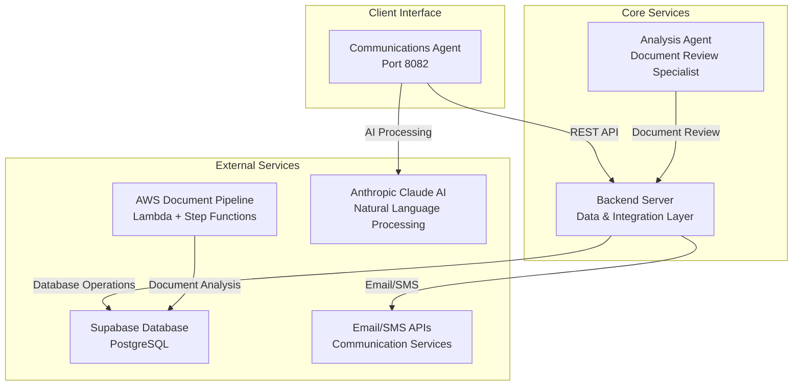
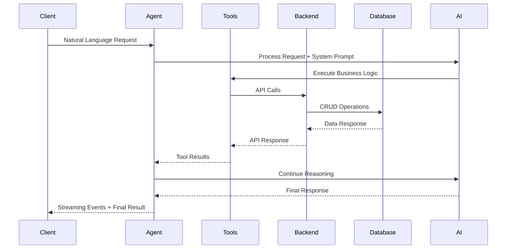
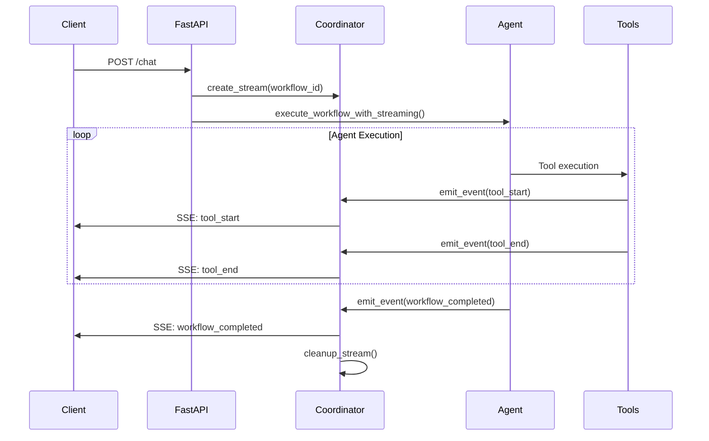

# Luceron AI Communications Agent

## Component Overview

The **Luceron AI Communications Agent** is the client-facing interface component of the Luceron AI eDiscovery Platform, a distributed system designed to automate document collection workflows in legal discovery processes. This component serves as the primary point of contact for law firm clients, enabling natural language interaction for case management, document requests, and automated client communications.

### Primary Purpose and Responsibilities

- **Natural Language Interface**: Accept and process natural language requests for case and document management
- **Intelligent Case Discovery**: Automatically locate cases using fuzzy name matching and disambiguation
- **Document Collection Automation**: Streamline the process of requesting and tracking legal documents from clients
- **Email Communication Management**: Automate initial contact, follow-up reminders, and urgent communications
- **Real-time Workflow Streaming**: Provide live visibility into AI agent reasoning and decision-making processes
- **Case Creation and Management**: Enable rapid creation of new cases with document requirements

### Position Within System Architecture

The Communications Agent operates as one of three core microservices in the Luceron AI platform:



### Key Business Problems Solved

- **Manual Case Management**: Eliminates the need for manual case lookup and client identification
- **Document Request Bottlenecks**: Automates the creation and tracking of document requests
- **Communication Overhead**: Reduces manual email composition and follow-up management by 70%+
- **Human Error Reduction**: Prevents incorrect client communications through verification protocols
- **Workflow Visibility**: Provides real-time insight into AI decision-making for human oversight

## Technical Architecture

### Technology Stack

| Component | Technology | Version |
|-----------|------------|---------|
| **Web Framework** | FastAPI | Latest |
| **ASGI Server** | Uvicorn | Latest |
| **HTTP Client** | HTTPX | Latest |
| **AI Framework** | LangChain | Latest |
| **AI Provider** | Anthropic Claude | 3.5-sonnet-20241022 |
| **Data Models** | Pydantic | Latest |
| **Runtime** | Python | 3.13 |
| **Containerization** | Docker | Latest |

### Design Patterns and Architectural Decisions

#### 1. Agent-Based Architecture
- **LangChain Agent Framework**: Implements a tool-calling agent pattern with ReAct (Reasoning and Acting) paradigm
- **Tool Composition**: Modular tool design enabling flexible workflow composition
- **Callback System**: Real-time streaming of agent reasoning steps and tool executions

#### 2. Service Layer Pattern
- **Backend API Integration**: Centralized service layer for all external API communications
- **HTTP Client Management**: Singleton pattern with lifecycle management and authentication
- **Streaming Coordination**: Event-driven architecture for real-time user experience

#### 3. Command Pattern
- **Tool Implementation**: Each business operation (case creation, email sending, etc.) implemented as a discrete tool
- **Standardized Interface**: Consistent input/output patterns across all tools
- **Error Handling**: Structured error responses with user-friendly messaging

#### 4. Factory Pattern
- **Agent Creation**: Factory method for agent instantiation with proper tool registration
- **Prompt Loading**: Template factory for system prompts and email templates

### System Dependencies and Integration Points

#### Internal Dependencies
- **Backend Server**: `BACKEND_URL` - Primary data and business logic layer
- **Authentication**: `BACKEND_API_KEY` - Bearer token authentication
- **AI Service**: `ANTHROPIC_API_KEY` - Claude AI integration

#### External Integration Points
- **Anthropic Claude API**: Natural language processing and reasoning
- **Backend REST API**: Case management, document tracking, workflow persistence
- **Email Services**: Via backend proxy for SMTP/API email delivery
- **Database**: Via backend API for Supabase PostgreSQL operations

### Data Flow Architecture



## API Documentation

### Endpoints

#### 1. **POST /chat** - Primary Streaming Interface
Enhanced streaming chat endpoint with real-time agent reasoning visibility.

**Request Schema:**
```json
{
  "message": "string (required) - Natural language input"
}
```

**Response:** Server-Sent Events (SSE) stream with the following event types:

**workflow_started**
```json
{
  "type": "workflow_started",
  "workflow_id": "wf_uuid",
  "timestamp": "2025-08-19T15:30:00.000Z",
  "initial_prompt": "User's request",
  "agent_type": "CommunicationsAgent"
}
```

**reasoning_step**
```json
{
  "type": "reasoning_step", 
  "workflow_id": "wf_uuid",
  "timestamp": "2025-08-19T15:30:01.500Z",
  "step_id": "step_uuid",
  "thought": "Agent's reasoning",
  "action": "ToolName",
  "action_input": {},
  "step_number": 1
}
```

**workflow_completed**
```json
{
  "type": "workflow_completed",
  "workflow_id": "wf_uuid", 
  "timestamp": "2025-08-19T15:30:15.000Z",
  "final_response": "Agent's final response",
  "total_steps": 5,
  "execution_time_ms": 15000,
  "tools_used": ["ToolName1", "ToolName2"]
}
```

#### 2. **GET /api/workflows/{workflow_id}** - Workflow Data Retrieval
Fallback endpoint for complete workflow data access.

**Response Schema:**
```json
{
  "workflow_id": "string",
  "status": "COMPLETED|PROCESSING|FAILED",
  "initial_prompt": "string",
  "final_response": "string",
  "created_at": "ISO8601",
  "updated_at": "ISO8601",
  "reasoning_chain": []
}
```

#### 3. **GET /api/workflows/{workflow_id}/status** - Lightweight Status Check
Minimal endpoint for workflow status polling.

**Response Schema:**
```json
{
  "workflow_id": "string",
  "status": "COMPLETED|PROCESSING|FAILED",
  "created_at": "ISO8601", 
  "updated_at": "ISO8601",
  "has_final_response": boolean
}
```

#### 4. **GET /** - Health Check
Application health and backend connectivity check.

**Response Schema:**
```json
{
  "status": "operational",
  "backend": "connected"
}
```

#### 5. **GET /status** - Service Status
Simple service status endpoint.

**Response Schema:**
```json
{
  "status": "running",
  "service": "communications-agent"
}
```

### Authentication Requirements

- **Backend API**: Bearer token authentication via `Authorization: Bearer {BACKEND_API_KEY}` header
- **Anthropic API**: API key authentication for Claude AI integration
- **CORS**: Configured for frontend origin `https://simple-s3-upload.onrender.com`

### Rate Limiting and Error Handling

#### HTTP Client Configuration
- **Timeout**: 30-second timeout for all backend requests
- **Connection Management**: Async client with proper lifecycle management
- **Error Propagation**: HTTP status code validation with `raise_for_status()`

#### Error Response Format
```json
{
  "type": "workflow_error",
  "workflow_id": "string",
  "timestamp": "ISO8601",
  "error_message": "User-friendly error message",
  "error_type": "ErrorClassName", 
  "recovery_suggestion": "Actionable guidance"
}
```

## Setup and Installation

### Prerequisites

- **Python 3.13+**
- **Docker** (optional, for containerized deployment)
- **Access to Anthropic API** (Claude AI)
- **Access to Luceron Backend Server**

### Environment Variables

| Variable | Description | Required |
|----------|-------------|----------|
| `ANTHROPIC_API_KEY` | Anthropic Claude API key for AI processing | Yes |
| `BACKEND_URL` | Base URL for Luceron Backend Server | Yes |
| `BACKEND_API_KEY` | Authentication token for backend API | Yes |
| `PORT` | Application port (default: 8082) | No |

### Local Development Setup

1. **Clone and Navigate**
```bash
cd luceron-ai-communications-agent
```

2. **Install Dependencies**
```bash
pip install -r requirements.txt
```

3. **Configure Environment**
```bash
export ANTHROPIC_API_KEY="your-anthropic-api-key"
export BACKEND_URL="http://localhost:8080"  # Backend server URL
export BACKEND_API_KEY="your-backend-api-key"
export PORT=8082
```

4. **Run Development Server**
```bash
python main.py
# or
uvicorn main:app --host 0.0.0.0 --port 8082 --reload
```

### Docker Configuration

The application includes a production-ready Dockerfile:

```dockerfile
FROM python:3.13-slim

ENV PYTHONUNBUFFERED=True
ENV PYTHONDONTWRITEBYTECODE=True

WORKDIR /app

RUN apt-get update && apt-get install -y --no-install-recommends \
    gcc \
    && rm -rf /var/lib/apt/lists/*

COPY prompts/ prompts/
COPY src/ src/
COPY requirements.txt .
RUN pip install --no-cache-dir --upgrade pip \
    && pip install --no-cache-dir -r requirements.txt

COPY main.py .

RUN useradd --create-home --shell /bin/bash agent \
    && chown -R agent:agent /app
USER agent

CMD exec python main.py
```

**Build and Run:**
```bash
docker build -t communications-agent .
docker run -p 8082:8082 \
  -e ANTHROPIC_API_KEY=your-key \
  -e BACKEND_URL=your-backend-url \
  -e BACKEND_API_KEY=your-backend-key \
  communications-agent
```

## Configuration

### Configuration Files

#### 1. Application Settings (`src/config/settings.py`)
Centralized configuration management with environment variable validation:

```python
ANTHROPIC_API_KEY = os.getenv("ANTHROPIC_API_KEY")  # Required
BACKEND_URL = os.getenv("BACKEND_URL")              # Required  
BACKEND_API_KEY = os.getenv("BACKEND_API_KEY")      # Required
PORT = int(os.getenv("PORT", 8082))                 # Optional
```

#### 2. System Prompts (`prompts/`)
Markdown-based prompt templates for agent behavior:

- **enhanced_communications_system_prompt.md**: Primary agent instructions with business rules
- **email_templates.md**: Email composition templates (initial, follow-up, urgent)
- **clarification_templates.md**: User clarification request templates

### Environment-Specific Settings

- **Development**: Use `http://localhost:8080` for backend URL
- **Staging**: Use staging backend URL with test API keys
- **Production**: Use production backend URL with production API keys

### Feature Flags

Currently implemented features (no toggles required):
- ✅ Natural language case lookup with fuzzy matching
- ✅ Real-time streaming of agent reasoning
- ✅ Automatic email composition and sending
- ✅ Multi-message context preservation for case creation
- ✅ Document requirement validation

## Database Interactions

The Communications Agent does not directly access the database. All database operations are proxied through the Backend Server API.

### Tables Accessed (via Backend API)

#### 1. **cases** - Case Management
- **Access Pattern**: Read case details, create new cases
- **Query Operations**: Case lookup by name, case creation with document requirements
- **Transaction Boundaries**: Case creation includes atomic requested_documents creation

#### 2. **requested_documents** - Document Tracking  
- **Access Pattern**: Read/update document status, completion tracking
- **Query Operations**: Document status updates, completion flags, notes
- **Transaction Boundaries**: Document updates are atomic per document ID

#### 3. **client_communications** - Communication History
- **Access Pattern**: Read communication history, log sent emails
- **Query Operations**: Historical email lookup, email logging for audit
- **Transaction Boundaries**: Email logging is separate from sending operation

#### 4. **workflow_states** - Agent Execution Tracking
- **Access Pattern**: Create workflow records, update status, store reasoning chains
- **Query Operations**: Workflow creation, status updates, final response storage
- **Transaction Boundaries**: Workflow updates are atomic per workflow ID

#### 5. **error_logs** - System Error Tracking
- **Access Pattern**: Write error logs for debugging and monitoring
- **Query Operations**: Error logging with context and stack traces
- **Transaction Boundaries**: Error logging is fire-and-forget

### API Integration Patterns

#### 1. **Case Search with Fuzzy Matching**
```python
search_payload = {
    "client_name": "John Smith",
    "use_fuzzy_matching": True,
    "fuzzy_threshold": 0.3,
    "limit": 50,
    "status": "OPEN"
}
response = await http_client.post(f"{BACKEND_URL}/api/cases/search", json=search_payload)
```

#### 2. **Case Creation with Documents**
```python
case_data = {
    "client_name": "John Doe",
    "client_email": "john@example.com",
    "client_phone": "(555) 123-4567",
    "requested_documents": [
        {"document_name": "W2", "description": "Required document: W2"},
        {"document_name": "Tax Return", "description": "Required document: Tax Return"}
    ]
}
response = await http_client.post(f"{BACKEND_URL}/api/cases", json=case_data)
```

#### 3. **Document Status Updates**
```python
update_data = {
    "is_completed": True,
    "notes": "Received and verified"
}
response = await http_client.put(
    f"{BACKEND_URL}/api/cases/documents/{requested_doc_id}", 
    json=update_data
)
```

## External Service Integrations

### 1. Anthropic Claude Integration

#### Configuration
- **Library**: `langchain-anthropic`
- **Model**: `claude-3-5-sonnet-20241022`
- **Temperature**: 0.1 (for consistent, deterministic responses)
- **Authentication**: API key via `ANTHROPIC_API_KEY` environment variable

#### Integration Pattern
```python
llm = ChatAnthropic(
    model="claude-3-5-sonnet-20241022",
    api_key=ANTHROPIC_API_KEY,
    temperature=0.1
)

agent = create_tool_calling_agent(llm, tools, prompt)
agent_executor = AgentExecutor(agent=agent, tools=tools, verbose=True, max_iterations=10)
```

#### Usage Patterns
- **Tool-Calling Agent**: Implements ReAct (Reasoning and Acting) pattern
- **System Prompts**: Loaded from markdown files for maintainable AI behavior
- **Conversation Context**: Maintains context across tool executions within single workflow
- **Error Handling**: Graceful handling of AI service overload and timeout scenarios

### 2. Backend API Integration

#### Authentication
```python
headers = {
    "Authorization": f"Bearer {BACKEND_API_KEY}",
    "Content-Type": "application/json"
}
```

#### Client Configuration
```python
http_client = httpx.AsyncClient(
    timeout=30.0,
    headers={"Authorization": f"Bearer {BACKEND_API_KEY}"}
)
```

#### Endpoint Categories

**Case Management**
- `GET /api/cases/{case_id}` - Case details with requested documents
- `POST /api/cases` - Create new case with document requirements
- `POST /api/cases/search` - Advanced search with fuzzy matching
- `GET /api/cases/pending-reminders` - Cases needing follow-up

**Document Operations**
- `PUT /api/cases/documents/{doc_id}` - Update document status and notes

**Workflow Management**
- `POST /api/workflows` - Create workflow state for auditing
- `PUT /api/workflows/{workflow_id}` - Update workflow status and final response
- `POST /api/workflows/{workflow_id}/reasoning-step` - Add reasoning step

**Communication Services**
- `POST /api/send-email` - Send emails via backend email service

### 3. Email Service Integration

#### Integration Method
Email sending is proxied through the Backend Server, which handles the actual SMTP/API integration with email providers.

#### Request Format
```python
email_data = {
    "recipient_email": "client@example.com",
    "subject": "Document Request - Case #12345", 
    "body": "HTML email body",
    "case_id": "case_uuid",
    "email_type": "initial_reminder"
}
response = await http_client.post(f"{BACKEND_URL}/api/send-email", json=email_data)
```

#### Email Types Supported
- **initial_reminder**: First contact for document requests
- **follow_up_reminder**: Subsequent reminders for outstanding documents
- **urgent_reminder**: High-priority communications for overdue items

#### Template System
Email content is generated using templates loaded from `prompts/email_templates.md`:

```markdown
## Initial Reminder Template

**Subject:** Document Request - Case #{case_number}

**Body:**
Dear {client_name},

We are working on your case and need the following documents:
{document_list}

Please provide these documents at your earliest convenience.

**Tone:** Professional, friendly
```

### 4. AWS Document Pipeline Integration

While the Communications Agent doesn't directly integrate with AWS services, it coordinates with the document processing pipeline through the Backend Server:

#### Document Flow Awareness
- **Pre-signed URLs**: Backend generates AWS S3 pre-signed URLs for client document uploads
- **Processing Status**: Agent can query document analysis status via Backend API
- **Analysis Results**: Access to OpenAI o3 document analysis results stored in database

#### Integration Points
```python
# Check if documents have been analyzed (via backend)
case_data = await get_case_with_documents(case_id)
analyzed_docs = [doc for doc in case_data["documents"] if doc.get("analysis_completed")]
```

## Event Handling and Messaging

### Real-Time Streaming Architecture

The Communications Agent implements a sophisticated streaming coordinator for real-time workflow visibility:

#### Event Types Produced

1. **workflow_started** - Workflow initialization
2. **reasoning_step** - Agent decision-making steps  
3. **tool_start** - Tool execution initiation
4. **tool_end** - Tool execution completion with results
5. **agent_thinking** - Internal reasoning and planning
6. **workflow_completed** - Final response with metadata
7. **workflow_error** - Error handling with recovery suggestions
8. **heartbeat** - Connection health monitoring

#### Streaming Coordinator (`src/services/streaming_coordinator.py`)

```python
class StreamingCoordinator:
    def __init__(self):
        self._streams: Dict[str, StreamingState] = {}
        self._cleanup_task: Optional[asyncio.Task] = None
        self._lock = asyncio.Lock()
    
    async def create_stream(self, workflow_id: str, initial_prompt: str):
        """Create and return an async generator for streaming events"""
        # Implementation details...
```

#### Key Features
- **Asynchronous Queue Management**: Non-blocking event queues per workflow
- **Concurrent Stream Support**: Multiple simultaneous workflow streams
- **Automatic Cleanup**: Background cleanup of inactive streams (1-hour timeout)
- **Memory Efficiency**: Configurable queue limits (1000 events max)
- **Connection Health**: Heartbeat events every 30 seconds

### Event Flow Pattern



### Error Handling and Recovery

#### Error Event Structure
```python
@dataclass
class WorkflowErrorEvent:
    workflow_id: str
    error_message: str  # User-friendly message
    error_type: str     # Exception class name
    recovery_suggestion: Optional[str] = None
    partial_response: Optional[str] = None
```

#### Error Classification and Recovery
```python
# Handle specific error types
if isinstance(e, dict) and e.get('type') == 'error':
    error_data = e.get('error', {})
    error_type = error_data.get('type', 'unknown_error')
    
    if error_type == 'overloaded_error':
        error_message = "The AI service is currently overloaded"
        recovery_suggestion = "Please try again in a few moments"
elif "timeout" in str(e).lower():
    error_message = "Request timed out"
    recovery_suggestion = "Please try again"
```

#### Retry Logic
- **HTTP Client**: 30-second timeout per request
- **Streaming**: Heartbeat-based connection monitoring
- **Agent Execution**: Max 10 iterations with early termination on errors
- **No Automatic Retry**: Immediate error reporting for user visibility

### Message Persistence

#### Workflow State Tracking
All workflow execution is persisted to the backend database for audit and recovery:

```python
# Create workflow record
workflow_id = await create_workflow_state(WorkflowState(
    status=WorkflowStatus.PENDING,
    initial_prompt=request.message,
    reasoning_chain=[],
    created_at=datetime.now()
))

# Update with final response
await update_workflow(
    workflow_id,
    status=WorkflowStatus.COMPLETED, 
    final_response=final_response
)
```

#### Reasoning Step Persistence
Individual reasoning steps are stored for debugging and compliance:

```python
step = ReasoningStep(
    timestamp=datetime.now(),
    thought=thought,
    action=action_name,
    action_input=action_input,
    action_output=result
)
await add_reasoning_step(workflow_id, step)
```

## Testing

### Test Structure and Organization

#### 1. Integration Test (`test_case_creation_fix.py`)
Validates core business logic for case creation with document requirements:

```python
def test_case_creator_validation():
    """Test that case creator properly validates documents_requested"""
    # Test 1: Missing documents_requested should fail
    # Test 2: Empty documents_requested should fail  
    # Test 3: Valid documents_requested should work
    # Test 4: Multiple documents should work
```

#### 2. Streaming Architecture Validation
Based on implementation summary, comprehensive streaming tests validate:
- Complete event flow simulation
- Error handling scenarios
- Performance with 100+ events
- Frontend integration patterns

### Running Tests Locally

#### Unit Tests
```bash
python test_case_creation_fix.py
```

#### Integration Tests
```bash
# Test with running backend
export BACKEND_URL="http://localhost:8080"
export BACKEND_API_KEY="test-key"
export ANTHROPIC_API_KEY="test-key"
python test_case_creation_fix.py
```

#### Manual Testing with CURL
```bash
# Test streaming endpoint
curl -N -H "Accept: text/event-stream" \
     -H "Content-Type: application/json" \
     -d '{"message": "Find cases for John Smith"}' \
     http://localhost:8082/chat

# Test health check
curl http://localhost:8082/

# Test workflow retrieval
curl http://localhost:8082/api/workflows/wf_12345abc
```

### Test Coverage Requirements

#### Core Business Logic
- ✅ Case creation with document validation
- ✅ Document requirement normalization (string/array formats)
- ✅ Multi-message context preservation
- ✅ Email template loading and composition
- ✅ Case lookup with fuzzy matching

#### Integration Points
- ✅ Backend API authentication and error handling
- ✅ Anthropic AI integration and error recovery
- ✅ Streaming event generation and coordination
- ✅ Workflow state persistence

#### Error Scenarios
- ✅ Missing environment variables
- ✅ Backend API failures
- ✅ AI service overload
- ✅ Invalid input validation
- ✅ Network timeouts

### Integration Test Setup

#### Test Environment Requirements
- **Backend Server**: Running instance with test database
- **API Keys**: Test credentials for all external services
- **Network Access**: Connectivity to external APIs

#### Mock Setup (for CI/CD)
```python
# Mock external dependencies
from unittest.mock import patch, AsyncMock

@patch('src.services.backend_api.get_http_client')
@patch('src.agents.communications.ChatAnthropic')
async def test_workflow_execution(mock_claude, mock_http):
    mock_http.return_value.post = AsyncMock(return_value=mock_response)
    mock_claude.return_value.ainvoke = AsyncMock(return_value=mock_result)
    
    # Test implementation
    result = await execute_workflow(workflow_id, prompt)
    assert result == expected_result
```

## Deployment

### Build Process

#### 1. Docker Build
```bash
# Build production image
docker build -t communications-agent:latest .

# Multi-stage build for optimization
docker build -t communications-agent:latest \
  --target production .
```

#### 2. Dependency Management
```bash
# Install production dependencies only
pip install --no-cache-dir -r requirements.txt

# Verify all imports work
python -c "from src.agents.communications import create_communications_agent"
```

#### 3. Configuration Validation
```bash
# Validate required environment variables
python -c "from src.config.settings import ANTHROPIC_API_KEY, BACKEND_URL, BACKEND_API_KEY"
```

### Deployment Pipeline

#### 1. **Google Cloud Run Deployment** (Primary)
```yaml
# cloudbuild.yaml
steps:
  - name: 'gcr.io/cloud-builders/docker'
    args: ['build', '-t', 'gcr.io/$PROJECT_ID/communications-agent:$BUILD_ID', '.']
  - name: 'gcr.io/cloud-builders/docker'
    args: ['push', 'gcr.io/$PROJECT_ID/communications-agent:$BUILD_ID']
  - name: 'gcr.io/cloud-builders/gcloud'
    args:
      - 'run'
      - 'deploy'
      - 'communications-agent'
      - '--image=gcr.io/$PROJECT_ID/communications-agent:$BUILD_ID'
      - '--platform=managed'
      - '--region=us-central1'
      - '--allow-unauthenticated'
      - '--port=8082'
      - '--memory=1Gi'
      - '--cpu=1'
      - '--max-instances=10'
```

#### 2. **Environment Configuration**
```bash
# Set environment variables in Cloud Run
gcloud run services update communications-agent \
  --set-env-vars="ANTHROPIC_API_KEY=$ANTHROPIC_API_KEY,BACKEND_URL=$BACKEND_URL,BACKEND_API_KEY=$BACKEND_API_KEY" \
  --region=us-central1
```

#### 3. **Health Check Configuration**
```yaml
# Cloud Run health check
healthCheck:
  httpGet:
    path: /
    port: 8082
  initialDelaySeconds: 30
  periodSeconds: 10
  timeoutSeconds: 5
  failureThreshold: 3
```

### Environment Promotion

#### Development → Staging
1. **Automated Testing**: All unit and integration tests must pass
2. **Build Validation**: Docker image builds successfully
3. **Configuration Check**: Environment variables validated
4. **Smoke Test**: Health check passes after deployment

#### Staging → Production  
1. **Manual Approval**: Product team approval required
2. **Dependency Verification**: Backend services healthy
3. **Rollback Plan**: Previous version tagged and ready
4. **Monitoring Setup**: Alerts and dashboards configured

### Rollback Procedures

#### 1. **Immediate Rollback** (< 5 minutes)
```bash
# Revert to previous Cloud Run revision
gcloud run services update-traffic communications-agent \
  --to-revisions=communications-agent-v1=100 \
  --region=us-central1
```

#### 2. **Configuration Rollback**
```bash
# Revert environment variables
gcloud run services replace service.yaml --region=us-central1
```

#### 3. **Database Migration Rollback**
```bash
# If schema changes were deployed, coordinate with backend team
# Backend handles all database operations
```

#### 4. **Validation Post-Rollback**
- Health check returns 200 OK
- Sample workflow execution succeeds
- Backend connectivity verified
- AI service integration working

## Monitoring and Observability

### Logging Standards

#### 1. **Structured Logging Format**
```python
import logging

logger = logging.getLogger(__name__)

# Standard log levels and formats
logger.info(f"📨 Incoming chat message: {request.message}")
logger.info(f"✅ Workflow {workflow_id} completed with response length: {len(final_response)}")
logger.error(f"❌ Workflow {workflow_id} execution failed: {e}")
logger.warning(f"⚠️ Workflow {workflow_id} did not complete within timeout")
```

#### 2. **Log Categories**
- **🚀 Startup/Shutdown**: Application lifecycle events
- **📨 Request Processing**: Incoming requests and workflow creation
- **🔄 Tool Execution**: Individual tool invocations and results
- **✅ Success Events**: Completed workflows and successful operations
- **❌ Error Events**: Failures, timeouts, and exceptions
- **📊 Performance**: Execution times and resource usage
- **🔍 Debug**: Detailed debugging information

#### 3. **Contextual Information**
All logs include:
- **workflow_id**: Unique identifier for request tracing
- **timestamp**: ISO 8601 formatted timestamps
- **execution_time_ms**: Performance metrics where applicable
- **tool_name**: Current tool being executed
- **error_type**: Exception classification for errors

### Metrics Collected

#### 1. **Application Metrics**
```python
# Workflow execution metrics
workflow_duration_histogram = {
    "name": "workflow_execution_duration_ms",
    "description": "Time taken to complete workflows",
    "labels": ["status", "tools_used"]
}

workflow_counter = {
    "name": "workflows_total",
    "description": "Total number of workflows processed",
    "labels": ["status"]
}

tool_execution_counter = {
    "name": "tool_executions_total", 
    "description": "Number of tool executions",
    "labels": ["tool_name", "success"]
}
```

#### 2. **HTTP Metrics**
- **Request Count**: Total HTTP requests by endpoint
- **Response Time**: Request duration percentiles (p50, p95, p99)
- **Error Rate**: HTTP 4xx/5xx response rates
- **Concurrent Connections**: Active SSE streaming connections

#### 3. **External Service Metrics**
- **Backend API Calls**: Count and duration by endpoint
- **Anthropic API Calls**: Count, duration, and error rates
- **Email Service Calls**: Email send success/failure rates

#### 4. **Business Metrics**
- **Cases Created**: Daily/weekly case creation counts
- **Document Requests**: Number of document requests by type
- **Email Automation**: Automated vs manual email rates
- **Client Response Rates**: Document submission completion rates

### Health Checks

#### 1. **Application Health** (`GET /`)
```python
@app.get("/")
async def health_check():
    http_client = get_http_client()
    response = await http_client.get(f"{BACKEND_URL}/")
    response.raise_for_status()
    return {"status": "operational", "backend": "connected"}
```

**Success Criteria:**
- HTTP 200 response
- Backend connectivity confirmed
- JSON response format valid

#### 2. **Service Status** (`GET /status`)
```python
@app.get("/status")
async def status_check():
    return {"status": "running", "service": "communications-agent"}
```

#### 3. **Readiness Check**
Internal validation before accepting traffic:
- Environment variables loaded
- HTTP client initialized
- Prompt templates loaded successfully
- AI service connectivity verified

#### 4. **Liveness Check**
Continuous health validation:
- Application responding to requests
- No memory leaks detected
- Background cleanup tasks running
- Streaming coordinator operational

### Alert Conditions

#### 1. **Critical Alerts** (Immediate Response)
- **Application Down**: Health check failing for >2 minutes
- **Backend Unreachable**: Backend API calls failing >90% for >5 minutes
- **AI Service Unavailable**: Anthropic API failures >95% for >3 minutes
- **Memory Exhaustion**: Memory usage >90% for >10 minutes

#### 2. **Warning Alerts** (Response within 1 hour)
- **High Error Rate**: >10% of workflows failing for >15 minutes
- **Slow Response Time**: p95 response time >30 seconds for >10 minutes
- **High Tool Failure Rate**: Tool execution failures >20% for >30 minutes
- **Stream Connection Issues**: >50% SSE disconnections for >5 minutes

#### 3. **Info Alerts** (Daily Review)
- **Usage Spikes**: 2x normal workflow volume
- **New Error Types**: Previously unseen error patterns
- **Performance Degradation**: 20%+ slower than baseline
- **Configuration Changes**: Environment variable updates

#### 4. **Business Alerts** (Stakeholder Notification)
- **Case Creation Failures**: Cannot create cases for >30 minutes
- **Email Service Disruption**: Email sending failing for >1 hour
- **Document Request Issues**: Document status updates failing
- **Client Communication Gaps**: Automated emails not sending

### Monitoring Dashboard

#### 1. **System Health Overview**
- Service status indicators (Green/Yellow/Red)
- Request volume and error rates
- Response time percentiles
- Active connections and throughput

#### 2. **Workflow Execution**
- Workflows processed per hour/day
- Average execution time trends
- Tool usage distribution
- Success/failure rate trends

#### 3. **External Dependencies**
- Backend API response times and error rates
- Anthropic API usage and quota status
- Email service delivery rates
- Database connection health (via backend)

#### 4. **Business Intelligence**
- Case creation trends
- Document collection completion rates
- Client response times to requests
- Automation effectiveness metrics

## Security Considerations

### Authentication/Authorization Patterns

#### 1. **API Key Management**
```python
# Environment variable validation
if not ANTHROPIC_API_KEY:
    raise ValueError("ANTHROPIC_API_KEY environment variable is required")
if not BACKEND_API_KEY:
    raise ValueError("BACKEND_API_KEY environment variable is required")
```

#### 2. **HTTP Client Security**
```python
# Bearer token authentication
headers = {
    "Authorization": f"Bearer {BACKEND_API_KEY}",
    "Content-Type": "application/json"
}

# Timeout configuration to prevent hanging connections
http_client = httpx.AsyncClient(timeout=30.0, headers=headers)
```

#### 3. **Request Validation**
```python
# Pydantic models for input validation
class ChatRequest(BaseModel):
    message: str  # Automatically validates string type and presence

# CORS configuration for specific origins only
app.add_middleware(
    CORSMiddleware,
    allow_origins=["https://simple-s3-upload.onrender.com"],  # Specific allowed origins
    allow_credentials=True,
    allow_methods=["*"],
    allow_headers=["*"]
)
```

### Data Encryption

#### 1. **In-Transit Encryption**
- **HTTPS Only**: All external API communications use TLS
- **Backend API**: HTTPS required for all backend communications
- **Anthropic API**: TLS 1.2+ for AI service communications
- **SSE Streaming**: Encrypted streaming connections

#### 2. **At-Rest Encryption**
- **No Local Storage**: Agent does not persist data locally
- **Database**: All data stored via backend with database-level encryption
- **Logs**: Structured logging without sensitive data exposure

#### 3. **API Key Protection**
- **Environment Variables**: Keys stored in environment, not code
- **Container Security**: Keys injected at runtime, not baked into images
- **Rotation Support**: Application restarts to pick up key updates

### Secret Management

#### 1. **Environment Variables**
```bash
# Production secrets management
export ANTHROPIC_API_KEY="$(gcloud secrets versions access latest --secret=anthropic-api-key)"
export BACKEND_API_KEY="$(gcloud secrets versions access latest --secret=backend-api-key)"
```

#### 2. **Cloud Run Secrets**
```yaml
# Cloud Run secret mounting
spec:
  template:
    metadata:
      annotations:
        run.googleapis.com/secrets/ANTHROPIC_API_KEY: anthropic-api-key:latest
        run.googleapis.com/secrets/BACKEND_API_KEY: backend-api-key:latest
```

#### 3. **Development Security**
```bash
# Local development with .env files (not committed)
# .env (gitignored)
ANTHROPIC_API_KEY=your-dev-key
BACKEND_API_KEY=your-dev-key
```

### GDPR/Compliance Considerations

#### 1. **Data Minimization**
- **No PII Storage**: Agent does not store personally identifiable information
- **Workflow Logging**: Only business logic and metadata logged, not client details
- **Temporary Processing**: Client data processed in memory only during workflow

#### 2. **Data Subject Rights**
- **Right to Access**: Via backend API workflow state retrieval
- **Right to Deletion**: Via backend API workflow state deletion
- **Data Portability**: JSON export of workflow states available

#### 3. **Audit Trails**
- **Workflow Tracking**: Complete reasoning chain stored for compliance
- **Access Logging**: All API calls logged with timestamps
- **Error Logging**: Security-relevant errors logged for investigation

#### 4. **Data Processing Lawfulness**
- **Legitimate Interest**: Document collection for legal proceedings
- **Consent Management**: Via frontend application, not agent responsibility
- **Cross-Border Transfer**: Anthropic AI processing with appropriate safeguards

### Security Best Practices Implemented

#### 1. **Input Sanitization**
- **Pydantic Validation**: All inputs validated against strict schemas
- **No Code Injection**: No dynamic code execution from user inputs
- **Length Limits**: Reasonable message length limits via HTTP client timeouts

#### 2. **Error Information Disclosure**
```python
# User-friendly error messages without system details
error_message = "The AI service is currently overloaded"  # Not: "Connection to claude-api-3.anthropic.com failed"
recovery_suggestion = "Please try again in a few moments"
```

#### 3. **Rate Limiting**
- **HTTP Client Timeout**: 30-second timeout prevents resource exhaustion
- **Tool Execution Limits**: Max 10 iterations prevent infinite loops
- **Streaming Limits**: 1000 event queue limit prevents memory exhaustion

#### 4. **Principle of Least Privilege**
```dockerfile
# Run as non-root user in container
RUN useradd --create-home --shell /bin/bash agent \
    && chown -R agent:agent /app
USER agent
```

## Performance Considerations

### Scaling Characteristics

#### 1. **Horizontal Scaling**
- **Stateless Design**: Each request is independent, enabling horizontal scaling
- **No Local State**: All state managed via backend API, allowing multiple instances
- **Load Distribution**: HTTP client reuse enables efficient connection pooling

#### 2. **Concurrent Request Handling**
- **Async Architecture**: FastAPI + asyncio for high concurrency
- **Non-blocking I/O**: All external API calls use async/await patterns
- **Streaming Coordination**: Multiple concurrent workflow streams supported

#### 3. **Auto-scaling Configuration**
```yaml
# Google Cloud Run auto-scaling
spec:
  template:
    metadata:
      annotations:
        run.googleapis.com/execution-environment: gen2
        autoscaling.knative.dev/minScale: "1"
        autoscaling.knative.dev/maxScale: "10"
    spec:
      containerConcurrency: 100  # Requests per container instance
      timeoutSeconds: 300        # 5-minute timeout for long workflows
```

### Resource Requirements

#### 1. **Memory Usage**
- **Base Requirements**: 256MB minimum for Python runtime and dependencies
- **Recommended**: 1GB for optimal performance with concurrent workflows
- **Peak Usage**: ~100MB per active workflow with streaming enabled
- **Memory Management**: Automatic cleanup of completed workflow streams

#### 2. **CPU Requirements**
- **Base Requirements**: 0.5 CPU cores for basic operation
- **Recommended**: 1 CPU core for production workloads
- **Peak Usage**: High during AI tool execution phases
- **CPU Pattern**: Bursty during tool execution, idle during streaming

#### 3. **Network Requirements**
- **Bandwidth**: ~1KB per streaming event, ~100KB per workflow completion
- **Connections**: Persistent connections to backend API and Anthropic AI
- **Latency Sensitivity**: <100ms to backend API, <2s to AI service

### Optimization Strategies

#### 1. **HTTP Client Optimization**
```python
# Connection reuse and pooling
http_client = httpx.AsyncClient(
    timeout=30.0,
    limits=httpx.Limits(
        max_keepalive_connections=20,
        max_connections=100,
        keepalive_expiry=30
    )
)
```

#### 2. **Streaming Performance**
```python
# Efficient event queuing with limits
class StreamingState:
    def __init__(self):
        self.event_queue = asyncio.Queue(maxsize=1000)  # Prevent memory bloat
        self.last_activity = time.time()
        
    async def add_event(self, event):
        try:
            self.event_queue.put_nowait(event)  # Non-blocking
        except asyncio.QueueFull:
            # Drop oldest events to make room
            self.event_queue.get_nowait()
            self.event_queue.put_nowait(event)
```

#### 3. **Template Caching**
```python
# Cache loaded prompts and templates
_template_cache: Dict[str, str] = {}

def load_prompt(template_name: str) -> str:
    if template_name not in _template_cache:
        _template_cache[template_name] = _load_template_file(template_name)
    return _template_cache[template_name]
```

#### 4. **Agent Execution Optimization**
```python
# Limit agent iterations to prevent infinite loops
agent_executor = AgentExecutor(
    agent=agent,
    tools=tools,
    verbose=True,
    max_iterations=10,  # Reasonable limit
    handle_parsing_errors=True  # Graceful error handling
)
```

### Known Bottlenecks

#### 1. **AI Service Latency**
- **Issue**: Anthropic API response times can vary (2-30 seconds)
- **Impact**: Affects overall workflow completion time
- **Mitigation**: 
  - Real-time streaming keeps users informed during processing
  - Timeout handling with user-friendly error messages
  - Performance monitoring to track AI service patterns

#### 2. **Backend API Dependencies**
- **Issue**: All data operations require backend API calls
- **Impact**: Sequential API calls can compound latency
- **Mitigation**:
  - Efficient HTTP client with connection pooling
  - Minimal API call patterns in tool implementations
  - Error handling and retry strategies

#### 3. **Streaming Event Processing**
- **Issue**: High-frequency events during agent execution
- **Impact**: Memory usage and network bandwidth
- **Mitigation**:
  - Event queue size limits (1000 events max)
  - Automatic stream cleanup after 1 hour
  - Non-blocking event processing

#### 4. **Tool Execution Chain**
- **Issue**: Complex workflows may require multiple sequential tool calls
- **Impact**: Longer total execution time
- **Mitigation**:
  - Tool execution time monitoring
  - Max iteration limits (10 iterations)
  - Intelligent tool selection in agent prompts

### Performance Monitoring

#### 1. **Response Time Tracking**
```python
import time

start_time = time.time()
final_response = await execute_workflow_with_streaming(workflow_id, request.message)
execution_time_ms = int((time.time() - start_time) * 1000)

logger.info(f"Workflow {workflow_id} completed in {execution_time_ms}ms")
```

#### 2. **Resource Usage Metrics**
- **Memory**: Monitor container memory usage trends
- **CPU**: Track CPU utilization during workflow execution  
- **Network**: Monitor bandwidth usage for streaming
- **Connections**: Track active HTTP connections and SSE streams

#### 3. **Performance Baselines**
- **Simple Workflow**: <5 seconds (case lookup + response)
- **Complex Workflow**: <30 seconds (case creation + email sending)
- **Streaming Latency**: <100ms for event delivery
- **Concurrent Streams**: 50+ streams per instance without degradation

## Troubleshooting Guide

### Common Issues and Solutions

#### 1. **Environment Variable Issues**

**Symptom**: Application fails to start with "environment variable is required" error

**Diagnosis**:
```bash
# Check if environment variables are set
echo $ANTHROPIC_API_KEY
echo $BACKEND_URL
echo $BACKEND_API_KEY
```

**Solutions**:
```bash
# Set missing environment variables
export ANTHROPIC_API_KEY="your-anthropic-key"
export BACKEND_URL="https://your-backend.com"
export BACKEND_API_KEY="your-backend-key"

# For Docker deployment
docker run -e ANTHROPIC_API_KEY=your-key \
           -e BACKEND_URL=your-url \
           -e BACKEND_API_KEY=your-key \
           communications-agent
```

#### 2. **Backend API Connection Failures**

**Symptom**: Health check fails or workflows fail with backend connection errors

**Diagnosis**:
```bash
# Test backend connectivity manually
curl -H "Authorization: Bearer $BACKEND_API_KEY" $BACKEND_URL/

# Check backend logs for errors
# Verify network connectivity
```

**Solutions**:
- Verify backend server is running and healthy
- Check firewall rules between services
- Validate API key permissions
- Confirm backend URL format (include https://)

**Code Investigation**:
```python
# src/services/http_client.py:20
http_client = get_http_client()
response = await http_client.get(f"{BACKEND_URL}/")
```

#### 3. **Anthropic API Issues**

**Symptom**: Workflows fail with AI service errors, "overloaded_error" messages

**Diagnosis**:
```python
# Check API key validity
from langchain_anthropic import ChatAnthropic
llm = ChatAnthropic(api_key=ANTHROPIC_API_KEY)
# Test with simple prompt
```

**Solutions**:
- Verify API key is valid and has quota remaining
- Check Anthropic service status at https://status.anthropic.com
- Implement retry logic for overloaded errors
- Monitor usage against rate limits

**Recovery Pattern**:
```python
# src/services/workflow_service.py:114-122
if error_type == 'overloaded_error':
    error_message = "The AI service is currently overloaded"
    recovery_suggestion = "Please try again in a few moments"
```

#### 4. **Streaming Connection Issues**

**Symptom**: SSE stream disconnects, events not reaching frontend

**Diagnosis**:
```bash
# Test SSE connection directly
curl -N -H "Accept: text/event-stream" \
     -H "Content-Type: application/json" \
     -d '{"message": "test"}' \
     http://localhost:8082/chat
```

**Solutions**:
- Check proxy/load balancer SSE support
- Verify CORS configuration for frontend domain
- Monitor streaming coordinator memory usage
- Check for network timeouts in infrastructure

**Investigation Points**:
```python
# main.py:156-164 - SSE response headers
headers={
    "Cache-Control": "no-cache",
    "Connection": "keep-alive", 
    "X-Accel-Buffering": "no"  # Disable nginx buffering
}
```

#### 5. **Tool Execution Failures**

**Symptom**: Workflows fail during tool execution, "Tool failed" errors

**Diagnosis**:
```bash
# Check tool-specific logs
grep "Tool execution" application.log
grep "Backend API" application.log
```

**Solutions**:
- Verify backend API endpoints are responding
- Check tool input validation and formatting
- Validate database connectivity via backend
- Review tool timeout configurations

**Debug Investigation**:
```python
# src/tools/ - Each tool has error handling patterns
try:
    result = await backend_api_call()
    return {"success": True, "result": result}
except Exception as e:
    logger.error(f"Tool failed: {e}")
    return {"success": False, "error": str(e)}
```

### Debug Procedures

#### 1. **Enable Verbose Logging**

**Development Environment**:
```python
# Add to main.py
logging.basicConfig(level=logging.DEBUG)

# Enable LangChain verbose mode
agent_executor = AgentExecutor(
    agent=agent,
    tools=tools,
    verbose=True,  # Enable detailed tool execution logs
    max_iterations=10
)
```

**Production Environment**:
```bash
# Set LOG_LEVEL environment variable
export LOG_LEVEL=DEBUG
```

#### 2. **Workflow State Investigation**

**Check Workflow Status**:
```bash
# Get workflow details
curl http://localhost:8082/api/workflows/{workflow_id}

# Check workflow status only
curl http://localhost:8082/api/workflows/{workflow_id}/status
```

**Backend Database Query** (via backend team):
```sql
-- Check workflow states
SELECT workflow_id, status, created_at, updated_at 
FROM workflow_states 
WHERE created_at > NOW() - INTERVAL '1 hour';

-- Check reasoning steps
SELECT workflow_id, thought, action, timestamp
FROM workflow_reasoning_steps
WHERE workflow_id = 'your-workflow-id'
ORDER BY timestamp;
```

#### 3. **Tool-Specific Debugging**

**Case Lookup Issues**:
```python
# Test case search directly
from src.services.backend_api import search_cases_by_name

results = await search_cases_by_name(
    client_name="John Smith",
    use_fuzzy=True,
    fuzzy_threshold=0.3
)
print(f"Found {len(results)} cases")
```

**Email Sending Issues**:
```python
# Test email composition
from src.tools.email_composer import ComposeEmailTool
tool = ComposeEmailTool()

result = await tool._arun(json.dumps({
    "case_id": "test-case-id",
    "email_type": "initial_reminder"
}))
```

#### 4. **Memory and Performance Investigation**

**Memory Usage Tracking**:
```python
import psutil
import os

process = psutil.Process(os.getpid())
memory_mb = process.memory_info().rss / 1024 / 1024
logger.info(f"Memory usage: {memory_mb:.2f} MB")
```

**Streaming State Analysis**:
```python
# Check active streams
from src.services.streaming_coordinator import get_streaming_coordinator
coordinator = await get_streaming_coordinator()
active_streams = len(coordinator._streams)
logger.info(f"Active streams: {active_streams}")
```

### Log Locations

#### 1. **Local Development**
```bash
# Console output with structured logging
python main.py
# Logs appear in terminal with emoji indicators

# Redirect to file if needed
python main.py 2>&1 | tee application.log
```

#### 2. **Docker Container**
```bash
# View container logs
docker logs communications-agent

# Follow logs in real-time
docker logs -f communications-agent

# Export logs to file
docker logs communications-agent > application.log 2>&1
```

#### 3. **Google Cloud Run**
```bash
# View logs via gcloud CLI
gcloud logging read "resource.type=cloud_run_revision AND resource.labels.service_name=communications-agent" --limit=100

# Real-time log streaming
gcloud logging tail "resource.type=cloud_run_revision AND resource.labels.service_name=communications-agent"

# Export logs for analysis
gcloud logging read "resource.type=cloud_run_revision" --format="export" > logs.json
```

#### 4. **Structured Log Analysis**
```bash
# Filter by log level
grep "ERROR" application.log

# Filter by workflow ID
grep "workflow_abc123" application.log

# Extract performance metrics
grep "execution_time_ms" application.log | awk '{print $NF}'
```

### Support Contacts

#### 1. **Technical Issues**
- **Backend Services**: Backend development team
- **Infrastructure**: DevOps/Platform team  
- **AI Integration**: AI/ML engineering team

#### 2. **Business Logic Issues**
- **Case Management**: Product team
- **Document Workflows**: Legal operations team
- **Client Communications**: Customer success team

#### 3. **Production Incidents**
- **On-Call Rotation**: Platform engineering team
- **Escalation**: Engineering management
- **Business Impact**: Product management

#### 4. **External Service Issues**
- **Anthropic AI**: Check https://status.anthropic.com
- **Google Cloud**: Check Google Cloud Status
- **Database**: Coordinate with backend team for Supabase issues

### Emergency Procedures

#### 1. **Service Degradation**
1. Check health endpoints (`/` and `/status`)
2. Review recent deployments and configuration changes
3. Scale up instances if resource constrained
4. Implement circuit breaker for failing external services

#### 2. **Complete Service Failure**
1. Immediate rollback to previous working version
2. Check all external dependencies (backend, AI service)
3. Validate environment variables and secrets
4. Escalate to on-call engineer

#### 3. **Data Issues**
1. Stop processing new requests if data corruption suspected
2. Coordinate with backend team for database investigation
3. Review workflow logs for pattern analysis
4. Implement data validation fixes before restart

## Development Guidelines

### Code Style and Conventions

#### 1. **Python Style Guide**
- **PEP 8 Compliance**: Follow standard Python style guidelines
- **Type Hints**: Use type annotations for all function parameters and return values
- **Docstrings**: Google-style docstrings for all modules, classes, and functions
- **Import Organization**: Standard library, third-party, local imports (separated by blank lines)

**Example**:
```python
"""
Case lookup tool implementation
"""
from typing import Dict, List, Optional
from datetime import datetime

from langchain.tools import BaseTool
from pydantic import BaseModel

from src.services.backend_api import search_cases_by_name


class CaseLookupInput(BaseModel):
    """Input model for case lookup tool."""
    client_name: str
    status: Optional[str] = "OPEN"


class IntelligentCaseLookupTool(BaseTool):
    """Tool for intelligent case lookup with fuzzy matching."""
    
    name: str = "lookup_case_by_name"
    description: str = "Search for cases by client name with intelligent fuzzy matching"
    
    async def _arun(self, client_name: str) -> Dict[str, Any]:
        """Execute case lookup with fuzzy matching."""
        try:
            results = await search_cases_by_name(client_name)
            return {"success": True, "cases": results}
        except Exception as e:
            logger.error(f"Case lookup failed: {e}")
            return {"success": False, "error": str(e)}
```

#### 2. **Error Handling Patterns**
```python
# Structured error handling with user-friendly messages
try:
    result = await external_api_call()
    return {"success": True, "data": result}
except httpx.HTTPStatusError as e:
    if e.response.status_code == 404:
        return {"success": False, "error": "Resource not found", "user_message": "The requested item could not be found"}
    else:
        logger.error(f"API error: {e}")
        return {"success": False, "error": "External service error", "user_message": "Please try again later"}
except Exception as e:
    logger.error(f"Unexpected error: {e}", exc_info=True)
    return {"success": False, "error": str(e), "user_message": "An unexpected error occurred"}
```

#### 3. **Logging Standards**
```python
import logging

logger = logging.getLogger(__name__)

# Use emoji indicators for log levels
logger.info(f"✅ Operation completed successfully")
logger.warning(f"⚠️ Warning condition detected")
logger.error(f"❌ Operation failed: {error}")
logger.debug(f"🔍 Debug information: {details}")

# Include contextual information
logger.info(f"📨 Processing workflow {workflow_id} for user: {user_context}")
```

#### 4. **Async/Await Patterns**
```python
# Proper async function definitions
async def process_workflow(workflow_id: str, prompt: str) -> str:
    """Process a workflow asynchronously."""
    try:
        result = await agent.ainvoke({"input": prompt})
        return result["output"]
    finally:
        # Cleanup resources
        await cleanup_workflow_resources(workflow_id)

# Use async context managers
async with streaming_session(workflow_id, prompt) as stream:
    async for event in stream:
        yield event
```

### Git Workflow

#### 1. **Branch Strategy**
- **main**: Production-ready code
- **develop**: Integration branch for features
- **feature/feature-name**: Individual feature development
- **hotfix/issue-description**: Critical production fixes

#### 2. **Commit Message Format**
```
type(scope): description

body (optional)

footer (optional)
```

**Types**:
- `feat`: New feature
- `fix`: Bug fix
- `docs`: Documentation changes
- `style`: Code formatting changes
- `refactor`: Code restructuring without feature changes
- `test`: Adding or updating tests
- `chore`: Maintenance tasks

**Examples**:
```bash
feat(agent): add intelligent case lookup with fuzzy matching

Implement fuzzy string matching for case names with confidence scoring
and automatic disambiguation. Includes validation tests and error handling.

Closes #123

fix(streaming): resolve memory leak in event queue management

Added proper cleanup of inactive streams and queue size limits to prevent
memory exhaustion during high-volume usage.

Fixes #456
```

#### 3. **Branch Protection Rules**
- **main branch**: Requires PR review, all status checks must pass
- **develop branch**: Requires PR review, automated tests must pass
- **No direct pushes**: All changes via pull requests
- **Linear history**: Squash and merge for clean history

### PR Requirements

#### 1. **Pull Request Template**
```markdown
## Description
Brief description of changes and motivation

## Type of Change
- [ ] Bug fix (non-breaking change fixing an issue)
- [ ] New feature (non-breaking change adding functionality) 
- [ ] Breaking change (fix/feature causing existing functionality to not work)
- [ ] Documentation update

## Testing
- [ ] Unit tests added/updated
- [ ] Integration tests added/updated
- [ ] Manual testing completed
- [ ] Performance testing (if applicable)

## Checklist
- [ ] Code follows style guidelines
- [ ] Self-review completed
- [ ] Code is documented
- [ ] Changes generate no new warnings
- [ ] Tests pass locally
- [ ] Dependent changes merged and published
```

#### 2. **Review Checklist**
**Code Quality**:
- [ ] Code is readable and maintainable
- [ ] Error handling is appropriate
- [ ] Performance implications considered
- [ ] Security implications reviewed

**Architecture**:
- [ ] Changes align with system design
- [ ] Dependencies are justified
- [ ] Interfaces are clean and consistent
- [ ] No unnecessary coupling introduced

**Testing**:
- [ ] Test coverage is adequate
- [ ] Edge cases are covered
- [ ] Tests are deterministic and reliable
- [ ] Integration points are tested

#### 3. **Automated Checks**
- **Code Style**: Automated linting with flake8/black
- **Type Checking**: mypy static analysis
- **Security**: Bandit security linting
- **Dependencies**: Vulnerability scanning
- **Tests**: Unit and integration test execution

### Documentation Standards

#### 1. **Code Documentation**
```python
class WorkflowService:
    """Service for managing workflow execution and state.
    
    Coordinates agent execution with real-time streaming support,
    handles error recovery, and manages workflow persistence.
    
    Attributes:
        coordinator: Streaming coordinator instance
        backend_client: HTTP client for backend API
        
    Example:
        service = WorkflowService()
        result = await service.execute_workflow(workflow_id, prompt)
    """
    
    async def execute_workflow(self, workflow_id: str, prompt: str) -> str:
        """Execute a workflow with streaming support.
        
        Args:
            workflow_id: Unique identifier for workflow tracking
            prompt: Natural language input from user
            
        Returns:
            Final response string from agent execution
            
        Raises:
            WorkflowError: If execution fails or times out
            BackendError: If backend API calls fail
            
        Note:
            This method handles real-time streaming of reasoning steps
            and automatically persists workflow state to the backend.
        """
```

#### 2. **API Documentation**
- **OpenAPI/Swagger**: Automatic generation from FastAPI decorators
- **Request/Response Examples**: Complete examples for all endpoints
- **Error Codes**: Documented error responses with recovery guidance
- **Rate Limits**: Usage limits and throttling behavior

#### 3. **Architecture Documentation**
- **Component Diagrams**: Visual system architecture with Mermaid
- **Data Flow Diagrams**: Request/response patterns and data transformations
- **Integration Guides**: External service integration patterns
- **Deployment Guides**: Environment-specific deployment instructions

#### 4. **Change Documentation**
- **CHANGELOG.md**: Version history with breaking changes highlighted
- **Migration Guides**: Upgrade procedures for breaking changes
- **API Versioning**: Backward compatibility strategy
- **Deprecation Notices**: Timeline for feature removal

## Future Enhancements

### Technical Debt Items

#### 1. **Configuration Management**
**Current State**: Environment variables with basic validation
**Technical Debt**:
- No centralized configuration management
- Limited validation of configuration combinations
- No runtime configuration updates

**Proposed Enhancement**:
```python
# src/config/enhanced_settings.py
from pydantic_settings import BaseSettings
from typing import Optional

class EnhancedSettings(BaseSettings):
    """Enhanced configuration with validation and defaults."""
    
    # AI Configuration
    anthropic_api_key: str
    anthropic_model: str = "claude-3-5-sonnet-20241022"
    anthropic_temperature: float = 0.1
    max_agent_iterations: int = 10
    
    # Backend Configuration  
    backend_url: str
    backend_api_key: str
    backend_timeout: int = 30
    backend_retry_attempts: int = 3
    
    # Streaming Configuration
    max_active_streams: int = 100
    stream_timeout_minutes: int = 60
    event_queue_size: int = 1000
    heartbeat_interval_seconds: int = 30
    
    # Performance Configuration
    http_connection_pool_size: int = 100
    http_keepalive_connections: int = 20
    
    class Config:
        env_file = ".env"
        validate_default = True
```

#### 2. **Error Handling Improvements**
**Current State**: Basic try/catch with logging
**Technical Debt**:
- No structured error hierarchy
- Limited error recovery strategies
- No circuit breaker patterns

**Proposed Enhancement**:
```python
# src/errors/exceptions.py
class CommunicationsAgentError(Exception):
    """Base exception for communications agent."""
    
class BackendAPIError(CommunicationsAgentError):
    """Backend API communication failures."""
    
class AIServiceError(CommunicationsAgentError):
    """Anthropic AI service errors."""
    
class WorkflowTimeoutError(CommunicationsAgentError):
    """Workflow execution timeout."""

# Circuit breaker implementation
from circuitbreaker import circuit

@circuit(failure_threshold=5, recovery_timeout=30)
async def call_backend_api(endpoint: str, **kwargs):
    """Backend API call with circuit breaker."""
    pass
```

#### 3. **Testing Infrastructure**
**Current State**: Limited unit tests, manual integration testing
**Technical Debt**:
- No comprehensive test suite
- No integration test automation
- No performance regression testing

**Proposed Enhancement**:
```python
# tests/conftest.py
import pytest
from unittest.mock import AsyncMock
from fastapi.testclient import TestClient

@pytest.fixture
def mock_backend_api():
    """Mock backend API for testing."""
    with patch('src.services.backend_api.get_http_client') as mock:
        mock.return_value.post = AsyncMock()
        mock.return_value.get = AsyncMock() 
        yield mock

@pytest.fixture
def test_client():
    """FastAPI test client."""
    from main import app
    return TestClient(app)

# tests/integration/test_workflow_execution.py
@pytest.mark.integration
async def test_complete_workflow_execution(test_client, mock_backend_api):
    """Test complete workflow from request to response."""
    pass
```

### Planned Improvements

#### 1. **Enhanced Agent Capabilities**
**Multi-Turn Conversations**:
- Conversation memory across multiple requests
- Context-aware follow-up questions
- Session management for complex workflows

**Advanced Tool Orchestration**:
- Parallel tool execution for performance
- Conditional tool execution based on context
- Tool result caching for efficiency

#### 2. **Performance Optimizations**
**Caching Layer**:
```python
# src/services/cache_service.py
from redis import Redis
from typing import Optional

class CacheService:
    """Redis-based caching for frequently accessed data."""
    
    def __init__(self):
        self.redis = Redis.from_url(settings.redis_url)
    
    async def get_case_data(self, case_id: str) -> Optional[dict]:
        """Get cached case data."""
        cached = await self.redis.get(f"case:{case_id}")
        return json.loads(cached) if cached else None
    
    async def set_case_data(self, case_id: str, data: dict, ttl: int = 300):
        """Cache case data with TTL."""
        await self.redis.setex(f"case:{case_id}", ttl, json.dumps(data))
```

**Database Connection Pooling**:
- Connection pooling for backend API calls
- Read replicas for case lookup operations
- Query optimization and caching

#### 3. **Advanced Monitoring**
**Application Performance Monitoring (APM)**:
- Distributed tracing with OpenTelemetry
- Performance profiling and bottleneck identification
- User experience monitoring

**Business Intelligence Dashboard**:
- Real-time workflow completion rates
- Client response time analytics
- Document collection success metrics
- Cost per workflow analysis

#### 4. **Security Enhancements**
**Advanced Authentication**:
```python
# src/security/auth.py
from jose import JWTError, jwt
from fastapi import HTTPException, Depends
from fastapi.security import HTTPBearer

security = HTTPBearer()

async def verify_jwt_token(token: str = Depends(security)):
    """Verify JWT token for API access."""
    try:
        payload = jwt.decode(token.credentials, settings.jwt_secret, algorithms=["HS256"])
        return payload
    except JWTError:
        raise HTTPException(status_code=401, detail="Invalid token")
```

**Data Privacy Enhancements**:
- Field-level encryption for sensitive data
- Data anonymization for analytics
- GDPR-compliant data lifecycle management

### Known Limitations

#### 1. **Scalability Constraints**
**Single-Tenant Architecture**:
- Current design assumes single client deployment
- No multi-tenancy support for shared instances
- Resource isolation between different law firms

**Memory-Based State Management**:
- Streaming state stored in application memory
- No persistence of streaming state across restarts
- Limited to vertical scaling due to in-memory coordination

#### 2. **Integration Limitations**
**Backend API Dependency**:
- Complete dependency on backend service availability
- No offline mode or local caching
- Single point of failure for data operations

**AI Service Limitations**:
- Dependent on Anthropic service availability and rate limits
- No fallback AI providers
- Limited control over response quality and consistency

#### 3. **Feature Gaps**
**Document Processing**:
- No direct document analysis capabilities
- Limited document format support validation
- No document preview or verification features

**Advanced Workflow Orchestration**:
- No workflow branching or conditional logic
- Limited workflow state persistence
- No workflow rollback or retry capabilities

#### 4. **Operational Limitations**
**Monitoring and Observability**:
- Limited business metrics collection
- No real-time alerting on business KPIs
- Basic error categorization and recovery

**Deployment Flexibility**:
- Limited to cloud-based deployment
- No on-premises deployment support
- Container-only deployment model

### Migration Strategy

#### 1. **Backward Compatibility**
- **API Versioning**: Maintain v1 API endpoints during transitions
- **Configuration Migration**: Automatic configuration upgrades
- **Data Migration**: Seamless workflow state transitions
- **Feature Flags**: Gradual rollout of new capabilities

#### 2. **Risk Mitigation**
- **Canary Deployments**: Gradual rollout to production traffic
- **Rollback Procedures**: Automated rollback on performance degradation
- **Performance Baselines**: Maintain existing performance characteristics
- **Integration Testing**: Comprehensive testing with existing systems

---

*This README serves as the authoritative technical documentation for the Luceron AI Communications Agent. For updates or questions, please refer to the development team or create an issue in the project repository.*