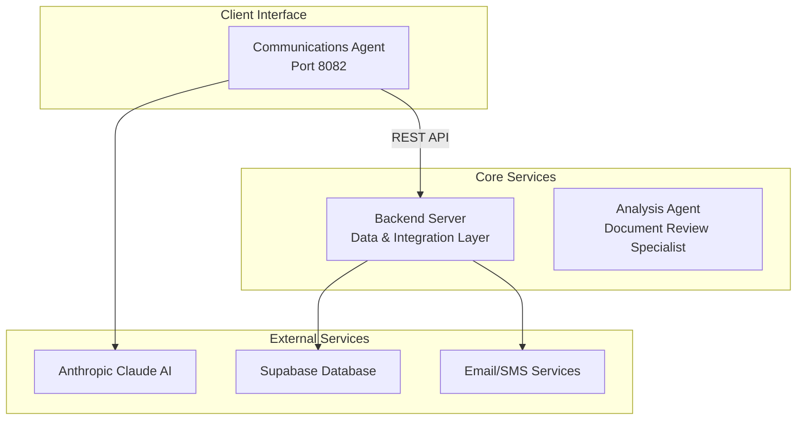

# Luceron AI Communications Agent

## Overview

The Luceron AI Communications Agent automates legal document collection for law firms through natural language processing. It serves as the primary client interface in the Luceron AI eDiscovery Platform, enabling automated case management, document requests, and client communications.

### Core Functionality

- **Natural Language Processing**: Processes attorney requests in plain English for case and document management
- **Intelligent Case Discovery**: Automatically locates cases using fuzzy name matching
- **Document Collection Automation**: Streamlines requesting and tracking legal documents from clients  
- **Email Communication Management**: Automates client contact, follow-ups, and urgent communications
- **Case Creation**: Creates new cases with document requirements through conversational interface

### System Architecture

The Communications Agent is one of three microservices in the Luceron AI platform:



### Business Impact

- Eliminates manual case lookup and client identification
- Automates document request creation and tracking
- Reduces manual email management by 70%+
- Prevents communication errors through verification protocols

## Technical Architecture

### Technology Stack

| Component | Technology | Purpose |
|-----------|------------|---------|
| **Web Framework** | FastAPI | REST API and request handling |
| **AI Framework** | LangChain | Agent-based tool execution |
| **AI Provider** | Anthropic Claude 3.5-sonnet | Natural language processing |
| **HTTP Client** | HTTPX | Backend API communication |
| **Runtime** | Python 3.13 | Application runtime |
| **Containerization** | Docker | Deployment packaging |

### Architecture Pattern

- **Agent-Based Processing**: Uses LangChain's tool-calling agent with ReAct (Reasoning and Acting) pattern
- **Service Layer Integration**: Centralized HTTP client for backend API communications  
- **Modular Tools**: Each business operation (case lookup, email sending) implemented as discrete tools
- **Stateless Processing**: Each request processed independently without session persistence

### Integration Dependencies

- **Backend Server**: Primary data layer via REST API (`BACKEND_URL`)
- **Anthropic Claude**: AI processing via API (`ANTHROPIC_API_KEY`) 
- **Email Services**: Client communications via backend proxy
- **Database**: Case and document data via backend API (Supabase PostgreSQL)

## API Endpoints

### POST /chat
Primary chat interface for natural language processing.

**Request:**
```json
{
  "message": "Find cases for John Smith"
}
```

**Response:**
```json
{
  "response": "Found 3 cases for John Smith..."
}
```

### GET /
Health check endpoint - verifies application and backend connectivity.

**Response:**
```json
{
  "status": "operational",
  "backend": "connected"
}
```

### GET /status
Service status check.

**Response:**
```json
{
  "status": "running", 
  "service": "communications-agent"
}
```

### Error Handling

Errors return structured responses with user-friendly messages:

```json
{
  "error": "The AI service is currently overloaded",
  "error_type": "ServiceUnavailable",
  "recovery_suggestion": "Please try again in a few moments"
}
```

## Setup and Installation

### Prerequisites

- Python 3.13+
- Docker (optional)
- Anthropic API access
- Luceron Backend Server access

### Environment Variables

| Variable | Description | Required |
|----------|-------------|----------|
| `ANTHROPIC_API_KEY` | Claude AI API key | Yes |
| `BACKEND_URL` | Backend server URL | Yes |
| `BACKEND_API_KEY` | Backend authentication token | Yes |
| `PORT` | Application port (default: 8082) | No |

### Local Development

1. **Install dependencies:**
```bash
pip install -r requirements.txt
```

2. **Set environment variables:**
```bash
export ANTHROPIC_API_KEY="your-anthropic-api-key"
export BACKEND_URL="http://localhost:8080"
export BACKEND_API_KEY="your-backend-api-key"
```

3. **Run the application:**
```bash
python main.py
```

### Docker Deployment

**Build and run:**
```bash
docker build -t communications-agent .
docker run -p 8082:8082 \
  -e ANTHROPIC_API_KEY=your-key \
  -e BACKEND_URL=your-backend-url \
  -e BACKEND_API_KEY=your-backend-key \
  communications-agent
```

## Configuration

### System Prompts

The agent uses markdown templates in the `prompts/` directory:

- `enhanced_communications_system_prompt.md` - Primary agent instructions and business rules
- `email_templates.md` - Email composition templates (initial, follow-up, urgent)  
- `clarification_templates.md` - User clarification request templates

### Current Features

- Natural language case lookup with fuzzy matching
- Automatic email composition and sending
- Case creation with document requirements
- Document requirement validation

## External Service Integrations

### Anthropic Claude Integration

- **Model**: claude-3-5-sonnet-20241022
- **Framework**: LangChain with tool-calling agent pattern
- **Temperature**: 0.1 for consistent responses
- **Authentication**: Via `ANTHROPIC_API_KEY` environment variable
- **Usage**: Natural language processing with ReAct (Reasoning and Acting) pattern

### Backend API Integration

- **Authentication**: Bearer token via `BACKEND_API_KEY`
- **Timeout**: 30-second request timeout
- **Key Endpoints**:
  - `POST /api/cases/search` - Case search with fuzzy matching
  - `POST /api/cases` - Create new cases with document requirements  
  - `PUT /api/cases/documents/{doc_id}` - Update document status
  - `POST /api/send-email` - Send client communications

### Email Service Integration

Email sending is proxied through the Backend Server:

**Email Types:**
- `initial_reminder` - First contact for document requests
- `follow_up_reminder` - Subsequent reminders for outstanding documents  
- `urgent_reminder` - High-priority communications

**Template System:**
Email content generated using templates from `prompts/email_templates.md` with variables like `{client_name}`, `{case_number}`, and `{document_list}`.

## Request Processing

The agent operates as a stateless service:

- **Direct Processing**: Each request processed independently without session persistence
- **Tool Execution**: Business logic executed through modular tools (case lookup, email sending, etc.)
- **Error Handling**: Structured error responses with user-friendly messages and recovery suggestions
- **Timeouts**: 30-second HTTP client timeout, max 10 agent iterations per request

## Testing

### Running Tests

**Unit Tests:**
```bash
python test_case_creation_fix.py
```

**Manual API Testing:**
```bash
# Test chat endpoint
curl -H "Content-Type: application/json" \
     -d '{"message": "Find cases for John Smith"}' \
     http://localhost:8082/chat

# Test health check
curl http://localhost:8082/
```

### Test Coverage

- Case creation with document validation
- Case lookup with fuzzy matching  
- Email template loading and composition
- Backend API integration and error handling
- Anthropic AI integration and error recovery

## Deployment

### Docker Build

```bash
# Build production image
docker build -t communications-agent:latest .
```

### Google Cloud Run Deployment

**Build and deploy:**
```bash
# Build and push to Google Container Registry
docker build -t gcr.io/$PROJECT_ID/communications-agent .
docker push gcr.io/$PROJECT_ID/communications-agent

# Deploy to Cloud Run
gcloud run deploy communications-agent \
  --image gcr.io/$PROJECT_ID/communications-agent \
  --platform managed \
  --region us-central1 \
  --port 8082 \
  --memory 1Gi \
  --cpu 1 \
  --max-instances 10
```

**Set environment variables:**
```bash
gcloud run services update communications-agent \
  --set-env-vars="ANTHROPIC_API_KEY=$ANTHROPIC_API_KEY,BACKEND_URL=$BACKEND_URL,BACKEND_API_KEY=$BACKEND_API_KEY" \
  --region us-central1
```

### Health Check

The service provides health endpoints:
- `GET /` - Application and backend connectivity check
- `GET /status` - Service status verification

## Monitoring and Observability

### Logging

The application uses structured logging with emoji indicators:

```python
logger.info(f"📨 Incoming chat message: {request.message}")
logger.info(f"✅ Request completed with response length: {len(final_response)}")
logger.error(f"❌ Request execution failed: {e}")
```

**Log Categories:**
- 🚀 Startup/Shutdown events
- 📨 Request processing  
- 🔄 Tool execution
- ✅ Success events
- ❌ Error events and exceptions

### Health Checks

- **`GET /`** - Application health and backend connectivity
- **`GET /status`** - Service status verification

### Key Metrics

- Request count and response times
- Tool execution success/failure rates  
- Backend API call duration and error rates
- Anthropic API usage and error rates
- Case creation and email automation rates

## Security

### Authentication

- **API Keys**: Environment variables for Anthropic and Backend API keys with validation
- **Bearer Token**: Backend API authentication via Authorization header
- **CORS**: Configured for specific frontend origins only

### Data Protection

- **HTTPS Only**: All external API communications use TLS encryption
- **No Local Storage**: Agent does not persist data locally - all data via backend API
- **Input Validation**: Pydantic models validate all request inputs
- **Error Handling**: User-friendly error messages without system details

### Container Security

- **Non-root User**: Docker container runs as non-privileged user
- **Secret Injection**: API keys injected at runtime, not baked into images
- **Resource Limits**: 30-second timeouts and iteration limits prevent resource exhaustion

## Performance

### Scaling

- **Stateless Design**: Each request processed independently, enabling horizontal scaling
- **Async Architecture**: FastAPI + asyncio for high concurrency
- **Resource Requirements**: 1GB memory, 1 CPU core recommended for production
- **Auto-scaling**: Cloud Run configured for 1-10 instances based on load

### Known Limitations

- **AI Service Latency**: Anthropic API response times vary (2-30 seconds)
- **Backend Dependencies**: All data operations require backend API calls
- **Sequential Processing**: Complex workflows require multiple tool calls in sequence

## Troubleshooting

### Common Issues

**Application won't start:**
- Check environment variables are set: `ANTHROPIC_API_KEY`, `BACKEND_URL`, `BACKEND_API_KEY`
- Verify backend server is running and accessible

**Health check fails:**
- Test backend connectivity: `curl -H "Authorization: Bearer $BACKEND_API_KEY" $BACKEND_URL/`
- Check backend server status and network connectivity

**AI service errors:**
- Verify Anthropic API key is valid and has quota remaining
- Check service status at https://status.anthropic.com
- Retry after brief delay for overloaded errors

### Logging

**Local development:**
```bash
python main.py  # Console output with emoji indicators
```

**Docker container:**
```bash
docker logs -f communications-agent
```

**Google Cloud Run:**
```bash
gcloud logging tail "resource.type=cloud_run_revision AND resource.labels.service_name=communications-agent"
```


